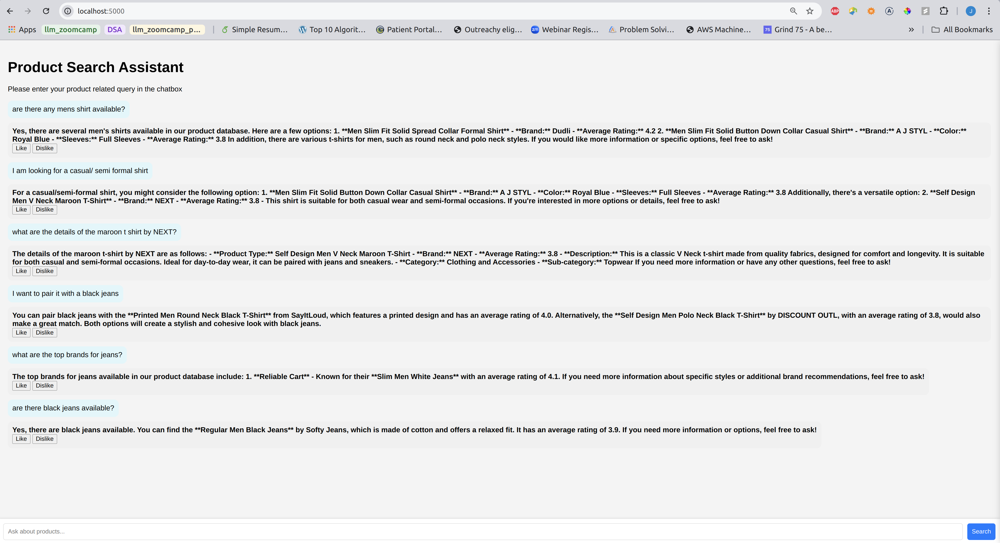
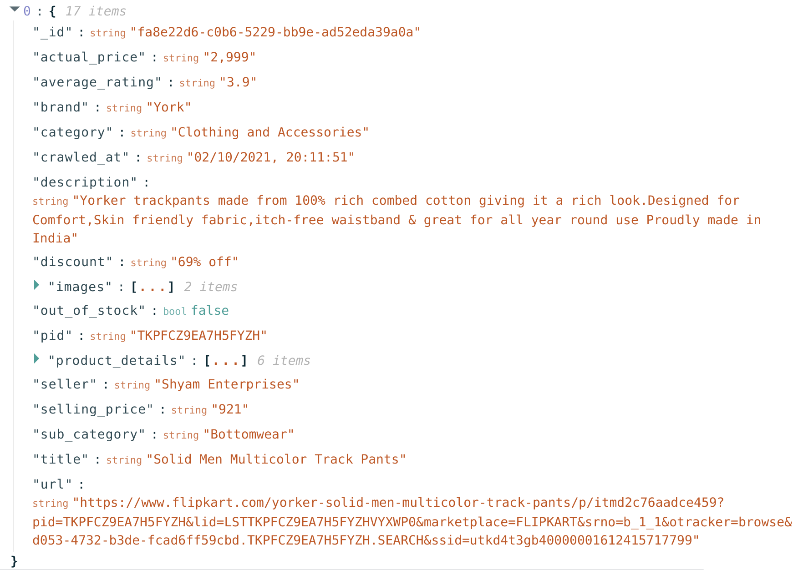

# Ecommerce Product Search Assistant

Online shopping is a convenient way of shopping which saves a lot of time. Websites like Amazon, Flipkart etc help us to find the best shopping experience. One of the issues with online shopping is that sometimes we have to read a lot description and reviews to know whether a particular product is the right fit for us. This project aims to build a product search assistant that can answer the user queries regarding products so that we can reduce the time needed by users to go through all the details of the product as well as the number of returns of purchaed products.
## Project overview

This is a RAG application that can be used to discover ecommerce products for the user. The application uses ElasticSearch to index the documents, and OpenAI to answer the user queries. 

<p align="center">
  
</p>


## Dataset
The datset used for this project is [ecommerce product dataset](https://www.kaggle.com/datasets/aaditshukla/flipkart-fasion-products-dataset?resource=download). The dataset consists of details of around 30K products from clothing and accessories category. The data is in json format. The data consists of fields like url, name, _id, crawled_at, selling_price, original_price, discount, brand, seller_name, seller_rating, images, product_details, pid, description, out_of_stock, flipkart_assured, breadcrumbs etc. A sample data of products is given below.
<p align="center">
  
</p>

The original dataset is stored at [data/data.json](data/data.json)A cleaned version of the data is stored at [`data/cleaned_data.json`](data/cleaned_data.json).

## Technologies

* Python 3.10
* Docker and Docker Compose for containerization
* ElasticSearch for indexing documents
* OpenAI as an LLM 
* PostgreSQL as the backend for storing user activities
* Flask as the API interface

## Preparation

As OpenAI is used as the LLM, you need to create an OpenAI key in the search_assistant_app/.env file.  The format of the .env file is available in the .env_template file. 
## Running the application

You can run the application using docker compose. The app starts elasticsearch server, creates an index, initialize the postgresql database, and then start the flask web app. The user activities are stored in the postgresql database. The dataset consists of around 30K records. As it takes a lot of time to build, only a few records are indexed. If you want to add more records, you can edit it in the `search_assistant_app/create_index.py` in line 97. Please note that indexing takes some time. 

```
cd search_assistant_app
sudo docker-compose up --build --force-recreate
```

## Using the application

The application can be accessed from the browser at http://localhost:5000. You can use the app to know details of the products available. 

## Code

The code for the application is in the [search_assistant_app](search_assistant_app) folder.

* app.py: The entry point for the flask application.
* create_index.py: Creates the elasticsearch index.
* db.py: the logic for logging the requests and responses to postgres.
* db_prep.py: Contains the script for initializing the backend.
* search.py: The scipt for the RAG implementation.

## Ingestion

The data ingestion script is in [create_index.py](search_assistant_app/ingestion.py). The script is run automatically by the container during startup. 

## Experiments

Jupyter notebook is used for experiments. 

* data_cleaning.ipynb: Used for cleaning the data before indexing. The cleaned data is available at [data/cleaned_data.json](data/cleaned_data.json).

* evaluation_data_generation.ipynb: Used for generating dataset for evaluation. Gpt-4o-mini is used for data generation.

* evaluation.ipynb: Used for evaluating different kinds of search. 

## Backend

The user data including user queries, results and feedback are stored in PostgreSQL. The database consists of 2 tables - conversations and feedback. This data could be used in the future for personalization.

